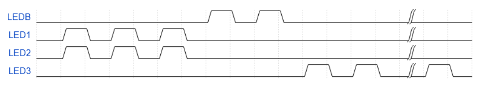

# Resolución de ejercicio B4 de Guia de ejercitación de RTOS de CESE (2021)
Autor:
Fernando Prokopiuk <fernandoprokopiuk@gmail.com>

Implemente un sistema de 4 tareas:

Led B - Tarea A - Prioridad +4

Led 1 - Tarea B - Prioridad +2

Led 2 - Tarea C - Prioridad +2

Led 3 - Tarea D - Prioridad +1

Arrancando solamente la tarea A antes de comenzar el scheduler, genere la siguiente secuencia de encendido y apagado (500ms/500ms):

El sistema deberá arrancar ejecutando la tarea de mayor prioridad solamente.

Las tareas B y C DEBEN tener un código fuente equivalente (salvando la parte en donde se accede al LED).

Ahora, configure en freertosconfig.h:
 #define configUSE_TIME_SLICING 0

¿Qué sucedió?

Proponga una manera de contrarrestar el efecto sin tocar la configuración mencionada (no utilice la Suspend/Resume para solucionarlo)

